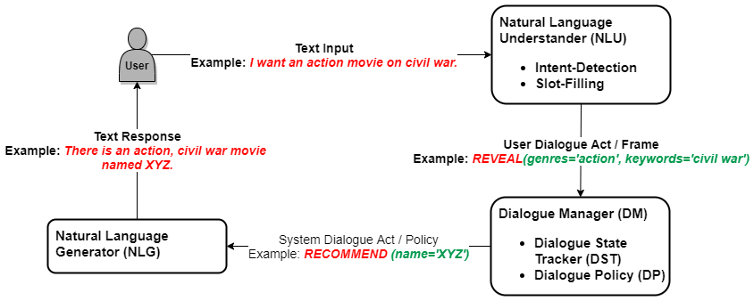

# *IAI MovieBot* movie recommender system
This is v0.1.

*IAI MovieBot* is an open-source, conversational movie recommender system which models users
' preferences dynamically and supports user initiatives and multi-turn recommendations.
*IAI MovieBot* equips with a scaleable structure for future amendments.
It facilities the standardized components.
In specific, intent recognition in NLU identifies users' intent based on preferences and
 recognizes entities (movies and attributes) for users' utterances, NLG generates natural language responses based on templates, and dialogue policy in the dialogue manager adapts to the users' requirements in the conversation.

The main architecture is shown in the figure below. A multi-turn conversation is initiated and terminated by the users. The users' response is processed by the NLU. The DM receives the users' dialogue acts from the NLU and generates the agent's dialogue acts. Based on the act from DM, the NLG generates a natural response to the users. This loop happens for each turn in the conversation.

## Main Components in *IAI MovieBot*:
- [Controller](moviebot/controller/controller.py)
  - [Controller Telegram Bot](moviebot/controller/controller_bot.py)
  - [Controller Terminal](moviebot/controller/controller_terminal.py)
- [Conversational Agent](moviebot/agent/agent.py)
  - [Natural Language Understanding](moviebot/nlu/nlu.py)
    - [Intents Detection](moviebot/nlu/user_intents_checker.py)
    - [Slot Filling](moviebot/nlu/slot_annotator.py)
    - [Data Loader](moviebot/nlu/data_loader.py)
  - [Natural Language Generation](moviebot/nlg/nlg.py)
  - [Dialogue Manager](moviebot/dialogue_manager/dialogue_manager.py)
    - [Dialogue State Tracker](moviebot/dialogue_manager/dialogue_state_tracker.py)
      - [Dialogue State](moviebot/dialogue_manager/dialogue_state.py)
      - [Dialogue Context](moviebot/dialogue_manager/dialogue_context.py)
    - [Dialogue Policy](moviebot/dialogue_manager/dialogue_policy.py)
    - [Dialogue Act](moviebot/dialogue_manager/dialogue_act.py)
      - [Item Constraints](moviebot/dialogue_manager/item_constraint.py)
      - [Slots](moviebot/dialogue_manager/slots.py)
      - [Operator](moviebot/dialogue_manager/operator.py)
      - [Values](moviebot/dialogue_manager/values.py)
- Intents
   - [User Intents](moviebot/intents/user_intents.py)
   - [Agent Intents](moviebot/intents/agent_intents.py)
 - Database/Ontology
   - [Database](moviebot/database/database.py)
   - [Ontology](moviebot/ontology/ontology.py)

## Data and Configuration files in *IAI MovieBot*:
- [Configuration](config/moviebot_config.yaml): This file defines the basic
 configuration of *IAI MovieBot* including the paths to database, ontology and the token of Telegram Bot.
- [Telegram Bot Token](config/bot_token.yaml): This file should contain the
 Telegram Bot Token in the following format:

        BOT_TOKEN: <<token>>

- [Tag words for NLU](config/tag_words_slots.json): The designed patters for
 detection of slots in NLU are defined in this file.
- [MySQL Database](data/movies_dbase.db)
- [Ontology](data/movies_ontology.json)
- [Slot-Values](data/slot_values.json): This file must be created by the NLU

## *IAI MovieBot* Installation

### Telegram Bot Token
- To use Telegram, one must install the Telegram application available [here](https://telegram.org/).
- Click [here](https://core.telegram.org/bots#6-botfather) for instructions about how to create a Telegram Bot.
- Add the token of the new bot to the [Telegram Bot Token](config/bot_token.yaml
) file as ``BOT_TOKEN: <<token>>``.

### Conversation History folder
Create a folder named `conversation_history`. The conversational logs will be saved in this folder if allowed in the config file. These logs will be created when the *IAI MovieBot* is being executed on Telegram.

### Python Libraries
- Execute the following commands to install necessary libraries for *IAI MovieBot*

       pip install pyyaml
       pip install python-telegram-bot --upgrade
       pip install wikipedia
       pip install nltk
       
### nltk Resources
       nltk.download('punkt')
       nltk.download('wordnet')
       nltk.download('stopwords')
	   
## Running *IAI MovieBot*

       python movie_bot.py -c <path_to_config.yaml>
       
Note: To create Slot-Values, execute the code once by setting `BOT: False` n the configuration file.
